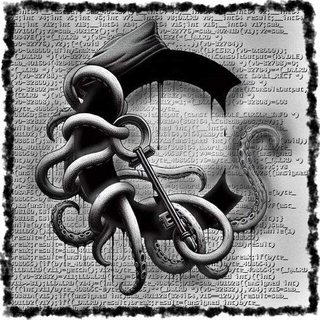
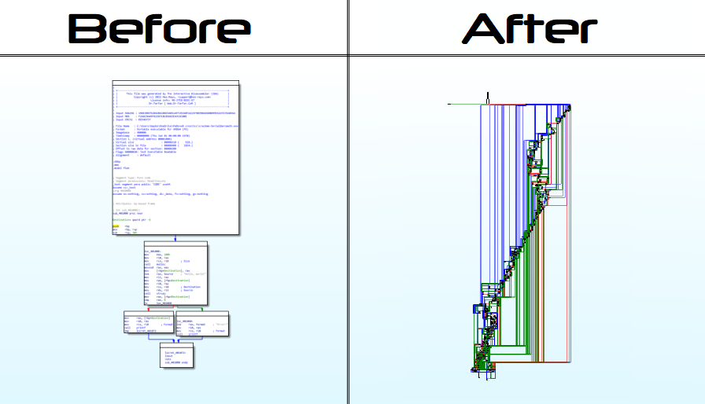

# obfus.h

**[obfus.h](https://github.com/DosX-dev/obfus.h/blob/main/include/obfus.h)** is a macro-only library for compile-time obfuscating C applications, designed specifically for the **[Tiny C (tcc)](https://bellard.org/tcc/)**. It is tailored for Windows x86 and x64 platforms and supports almost all versions of the compiler. **Very reliable armor for your C programs!**

### What features does it have?...
- 🔍 **Function Call Obfuscation**: Confuse function calls to make your code less readable to unauthorized eyes.
- 🛡️ **Anti-Debugging Techniques**: Built-in mechanisms to prevent code analysis during runtime.
- 🔄 **Control Flow Code Mutation**: Turns code into spaghetti, making it difficult to parse conditions and loops.
- 🚫 **Anti-Decompilation Techniques**: Makes many popular decompilers useless visually breaking their output.
- 😈 **Fake Signatures Adding**: Can add fake signatures of various packers and protectors to confuse reverse engineers.
- 🧠 **Virtualization**: Makes math operations very difficult to understand using virtual machine commands.

## 👾 Usage

Integrating **[obfus.h](https://github.com/DosX-dev/obfus.h/blob/main/include/obfus.h)** into your project is a simple process. Just include the following line in your code:
```c
#include "obfus.h"
```
This will automatically obfuscate your code during compilation, ensuring protection and confidentiality of your intellectual property.

> Available options for protection configuring:
> ```c
> // Additional options
> #define cflow_v2       1  // More powerful Control Flow obfuscation (slowly!)
> #define antidebug_v2   1  // Use better dynamic anti-debugging protection
> #define fake_signs     1  // Adds fake signatures of various protectors or packers
> 
> // Advanced code protection (see the "Virtualization" part of the documentation!)
> #define virt           1  // Allows you to use the functions of a math VM
> 
> // Disabling default features
> #define no_cflow       1  // Don't use Control-Flow obfuscation
> #define no_antidebug   1  // Don't build in debugging protection
> ```
> or use it with compiler args:
> 
> ```
> tcc "app.c" -w  -D no_cflow  -D antidebug_v2  -D fake_signs
> ```

⚠️ When compiling an application with obfuscation, use the `-w` argument to suppress warnings. Otherwise, the console will display numerous intimidating logs that have no impact on the final result. There's no need to be alarmed by them.

🔐 Debugging protection is triggered by calls to many basic MSVCRT functions.
In critical places in the code you can use the `ANTI_DEBUG;` construct. For example:
```c
ANTI_DEBUG;
if (!licenseExpired()) {
    // ...
}
```

## 👺 Virtualization
This is a protection technique in which certain calculations are performed through an embedded virtual machine upon command. Makes analysis of mathematical operations **very difficult**! It will work with the `virt` option enabled (and only!). Otherwise, all virtual machine commands will be replaced by ordinary mathematical operators.

⚠️ Virtualization in critical locations can impact optimization. Use with caution only in areas where it is really needed

| Function         | Type         | Op | Description                                                                | Example                              |
|------------------|--------------|----|----------------------------------------------------------------------------|--------------------------------------|
| **`VM_ADD`**     | *long*         |`+` | Adds two numbers                                                           | `VM_ADD(5, 3)` = **`8`**             |
| **`VM_SUB`**     | *long*         |`-` | Subtracts two numbers                                                      | `VM_SUB(5, 3)` = **`2`**             |
| **`VM_MUL`**     | *long*         |`*` | Multiplies two numbers                                                     | `VM_MUL(5, 3)` = **`15`**            |
| **`VM_DIV`**     | *long*         |`/` | Divides two numbers                                                        | `VM_DIV(6, 3)` = **`2`**             |
| **`VM_MOD`**     | *long*         |`%` | Calculates the modulus of two numbers                                      | `VM_MOD(5, 3)` = **`2`**             |
| **`VM_EQU`**     | *BOOL*         |`==`| Checks if two numbers are equal                                            | `VM_EQU(5, 5)` = **`true`**          |
| **`VM_NEQ`**     | *BOOL*         |`!=`| Checks if two numbers are not equal                                        | `VM_NEQ(5, 3)` = **`true`**          |
| **`VM_LSS`**     | *BOOL*         |`<` | Checks if the first number is less than the second number                  | `VM_LSS(3, 5)` = **`true`**          |
| **`VM_GTR`**     | *BOOL*         |`>` | Checks if the first number is greater than the second number               | `VM_GTR(5, 3)` = **`true`**          |
| **`VM_LEQ`**     | *BOOL*         |`<=`| Checks if the first number is less than or equal to the second number      | `VM_LEQ(3, 5)` = **`true`**          |
| **`VM_GEQ`**     | *BOOL*         |`>=`| Checks if the first number is greater than or equal to the second number   | `VM_GEQ(5, 3)` = **`true`**          |
| **`VM_ADD_DBL`** | *long double*  |`+` | Adds two double numbers                                                    | `VM_ADD_DBL(5.5, 3.2)` = **`≈8.7`**  |
| **`VM_SUB_DBL`** | *long double*  |`-` | Subtracts two double numbers                                               | `VM_SUB_DBL(5.5, 3.2)` = **`≈2.3`**  |
| **`VM_MUL_DBL`** | *long double*  |`*` | Multiplies two double numbers                                              | `VM_MUL_DBL(5.5, 3.2)` = **`≈17.6`** |
| **`VM_DIV_DBL`** | *long double*  |`/` | Divides two double numbers                                                 | `VM_DIV_DBL(6.0, 3.0)` = **`≈2.0`**  |
| **`VM_LSS_DBL`** | *BOOL*   |`<` | Checks if the first double number is less than the second double number    | `VM_LSS_DBL(3.5, 5.2)` = **`true`**  |
| **`VM_GTR_DBL`** | *BOOL*   |`>` | Checks if the first double number is greater than the second double number | `VM_GTR_DBL(5.5, 3.2)` = **`true`**  |

> The virtual machine does not support some basic `double` comparison operations.


A simple example of using virtualization::
```c
// ...
#define virt 1
// ...

if (VM_EQU(VM_ADD(2, 2), 4)) {
    printf("2 + 2 == 4!");
}

```

You can find examples of using all the functions of a virtual machine in the file [tests/virtualmachine.c](tests/virtualmachine.c)

## ❓ Example of using
If you need advanced protection against skilled reversers, use `cflow_v2` and `antidebug_v2` options.
```c
// Let's obfuscate your code!

#include <stdio.h>

#define virt         1 // [+] Use math virtual machine

#define cflow_v2     1 // [+] ControlFlow v2
#define fake_signs   1 // [+] Fake signatures
#define antidebug_v2 1 // [+] AntiDebug v2

#define no_cflow     0 // [-] Disable ControlFlow
#define no_antidebug 0 // [-] Disable AntiDebug


#include "obfus.h"

void main() {
    char *out = malloc(256);

    strcpy(out, "Hello, world!\n");

    if (out) {
        printf(out);
    } else {
        printf("Error!\n");
    }


    int result = VM_ADD(5, 7); // 5 + 7

    if (VM_EQU(result, 12)) { // (5 + 7) == 12
        printf("5 + 7 == 12");
    }
}
```

## 🛠 Compiler (important)
The latest version of **Tiny C** (`0.9.27`) is recommended for use. Unfortunately, some versions of the compiler do not support the functionality needed to completely obfuscation. **Visual C**, **GCC** and **Clang** *is not supported* and is unlikely to be supported.

## 📖 Summarize
The code of a program (and its original original logic) protected using **[obfus.h](https://github.com/DosX-dev/obfus.h/blob/main/include/obfus.h)** is almost **impossible to recover (deobfuscate)**. However, using this obfuscator does not guarantee complete protection against all types of threats. **It's important to develop and maintain internal program security systems.**

> **What the diagrammatic code will look like after obfuscation:**


> **The reverser will see something like this if he tries to use a decompiler:**


<!-- ```c
// BEFORE OBFUSCATION       
__int64 sub_4010B8() {
    printf("Hello, world!");
    return 0i64;
}
```

```c
// AFTER OBFUSCATION
 __int64 sub_401000() {
     *(_DWORD *)(a2 + v2) += v2;
     if ( !(_DWORD)a2 )
       JUMPOUT(0x100C3C9);
     MEMORY[0x100C3C9] &= a2;
     return (loc_4017B1)(asc_404159);
 }
``` -->

## 🌈 Special thanks
Thanks to everyone who helped in the development of this project. I appreciate it! ❤️
 * 👨🏼‍💻 **[@horsicq](https://github.com/horsicq)** *(for help with the code and advices)*
 * 🐺 **[@ac3ss0r](https://github.com/ac3ss0r)** *(for cool ideas and their solutions)*

And **thanks to you** 🤝 for paying attention to this project!